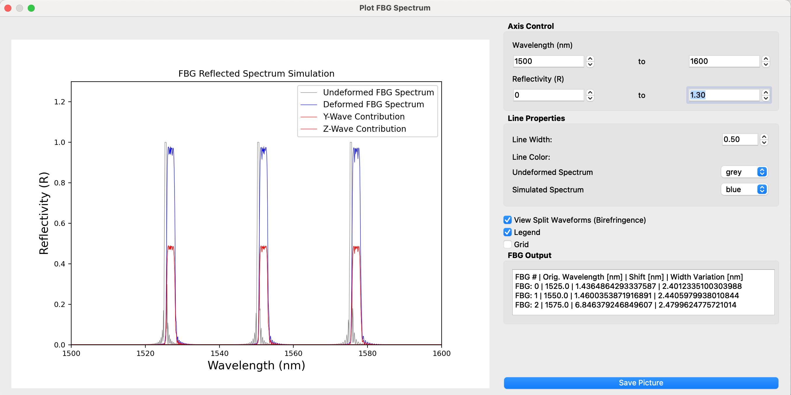

# FBG-SimPlus V1.0
Note: If you chose to use elements of this upgraded application in your own work, please cite: </br>
```
Frey, B., Snyder, P., Ziock, K., & Passian, A. (2021).
Semicomputational calculation of Bragg shift in stratified
materials. Physical Review E, 104(5), 055307.
```
</br>
This application is a fiber Bragg grating (FBG) simulation tool for Finite Element Method (FEM) models. Originally adapted from [FBG_SiMul](https://github.com/GilmarPereira/FBG_SiMul/blob/master/LICENSE) by [GilmarPereira](https://github.com/GilmarPereira), this software features inclusion of temperature variation emulation within the program. To start, the user can supply a raw data text file. Then, the user can render a simulated reflection spectrum of an array of FBG sensors in response to the following parameters:</br>
- Longitudinal Strain (Uniform and Non-Uniform)
- Transverse Stress
- Temperature
</br></br>


### Quick Start Guide
To start FBG-SimPlus, execute the file "python/run.py". For further information on program usage, refer to the file "documentation.pdf" and the tutorial subdirectoy.

### Software Requirements
* Python Version: 3.8
* Required Modules: pyqt (Ver. 5), scipy, matplotlib, sympy, six, numpy
* Developed on macOS, supports Windows 10 and Linux

### Acknowledgements
B. Frey acknowledges support from the National Science Foundation and Department of Defense under Grants PHY-1659598 and PHY-1950744. Any opinions, findings, and conclusions or recommendations expressed in this material are those of the author and do not necessarily reflect the views of the National Science Foundation or Department of Defense.

### Considerations
Please email Ben Frey (freynben@gmail.com) with questions or with run-time issues.

Current known issues:
1. Instability when plotting spectral responses, sometimes leads to program crash.
2. Inability to exit from program on macOS, requires force quit.
3. Saving plot picture inconsistent functionality.

### Copyright
Here we retain the original GNU General Public License v3.0 introduced by Dr. Pereira and have included the original file in this repository.